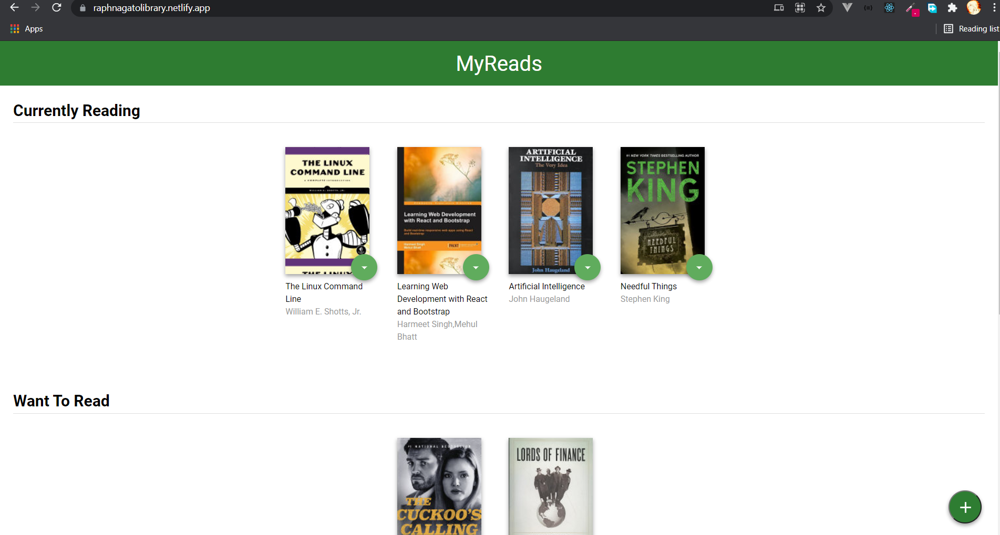
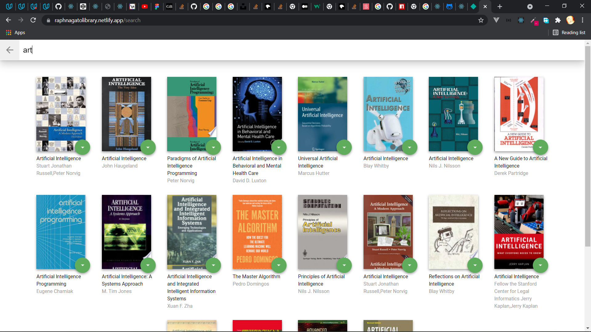

# MyReads Project

MyReads is a simple book library app where you can store books in three separate categories which are Currently Reading, Want To Read and Read.

You can also naviagte to the search route to find books using the name or the authors of the book.

This project is one of the required projects needed to graduate from the [Udacity React Nanodegree Program](https://www.udacity.com/course/react-nanodegree--nd019)

You can check out the **live demo:** [MyReads App](https://raphnagatolibrary.netlify.app/)

## Installation and Usage

Make sure git and node is installed on your system, then open your terminal and change your path to your preferred directory then:

- clone the repository with `git clone https://github.com/RaphaelNagato/reactnd-project-myreads-starter.git`
- change directory using the command `cd reactnd-project-myreads-starter`
- install all project dependencies with `npm install` or `yarn install`
- start the development server with `npm start` or `yarn start`

if port 3000 on your system isn't used by another process, you should be able to view the site at https://localhost:3000 in your browser

## Images

